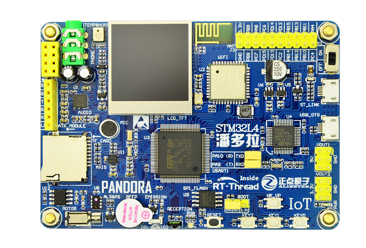

# STM32L475 潘多拉开发板 RT-Thread探索

## 开发板介绍

潘多拉 STM32L475 是正点原子推出的一款基于 ARM Cortex-M4 内核的开发板，最高主频为 80Mhz，该开发板具有丰富的板载资源，可以充分发挥 STM32L475 的芯片性能。

开发板外观如下图所示：



该开发板常用 **板载资源** 如下：

- MCU：STM32L475VET6，主频 80MHz，512KB FLASH ，128KB RAM
- 外部 FLASH：W25Q128 或 NM25Q128EVB（SPI，16MB）
- 常用外设
  - RGB 状态指示灯：1个，（红、绿、蓝三色）
  - 按键：4个，KEY_UP（兼具唤醒功能，PC13），K0（PD10），K1（PD9），K2（PD8）
  - 红外发射头，红外接收头
  - 有源蜂鸣器：1个
  - 光环境传感器：1个
  - 贴片电机：1个
  - 六轴传感器：1个
  - 高性能音频解码芯片：1个
  - 温湿度传感器（AHT10）：1个
  - TFTLCD 显示屏：1个
  - WIFI 模块（AP6181）：1个
  - 板载 ST LINK V2.1 功能
- 常用接口：SD 卡接口、USB OTG、Micro USB 接口
- 调试接口，ST-LINK Micro USB 接口

开发板更多详细信息请参考正点原子 [STM32 潘多拉开发板介绍](https://eboard.taobao.com/index.htm)。

## 外设支持

本 BSP 目前对外设的支持情况如下：

| **板载外设**      | **支持情况** | **备注**                              |
| :----------------- | :----------: | :------------------------------ |
| 板载 ST-LINK 转串口 |     支持     |                                    |
| QSPI_FLASH         |     支持     |                                   |
| SD 卡               |   支持       | 使用 SPI1 驱动 |
| 温湿度传感器        |    支持     |                             |
| 六轴传感器         |    支持     |                              |
| 音频解码           |    支持     |                                     |
| TFTLCD           |    支持     | 使用 SPI3 驱动 |
| 贴片电机           |    暂不支持     |即将支持                      |
| 光环境传感器       |    暂不支持     |即将支持                           |
| AP6181 WIFI 模块 | 支持 |使用 SDIO 驱动 |
| **片上外设**      | **支持情况** | **备注**                              |
| GPIO              |     支持     |                                      |
| UART              |     支持     |                                      |
| SPI               |     支持     |                                      |
| QSPI              |     支持     |                                      |
| I2C               |     支持     |                                      |
| TIM               |     支持     |                                      |
| ADC               |     支持     |                                      |
| RTC               |     支持     | 支持外部晶振和内部低速时钟 |
| WDT               |     支持     |                                      |
| PWM               |     支持     |                                      |
| USB Device        |   支持   |                          |
| USB Host          |   暂不支持   | 即将支持                              |
| **扩展模块**      | **支持情况** | **备注**                              |
| NRF24L01 模块  |     支持    | 根据实际板子接线情况修改 NRF24L01 软件包中的 `NRF24L01_CE_PIN` 和 `NRF24_IRQ_PIN` 的宏定义，以及 SPI 设备名 |
| ATK-ESP8266 模块  |    暂不支持  | 即将支持                              |
| ENC28J60 模块  |     暂不支持    | 即将支持                              |
使用该开发板的更多高级功能请参考 RT-Thread 代码仓库： [RT-Thread IoT-Board SDK](https://github.com/RT-Thread/IoT_Board)。

## BSP移植

首先用RT-Thread Studio从RT-Thread的BSP目录中导入该工程。

接着在Github上新建一个裸工程，不要添加任何内容。

然后采用如下操作，将我们的工程和Github建立连接：
``` {.line-numbers highlight=[5]}
git init
git add -A
git commit
git branch -M main
git remote add origin git@github.com:zyq5428/Pandora_STM32L475VET6_RT_Thread.git
git push -u origin main
```
如果第一次运行出现错误，请使用env进行以下配置：
  * 执行menuconfig命令
  * 选择Exit退出即可

## 应用程序移植

### GPIO引脚编号

RT-Thread 提供的引脚编号需要和芯片的引脚号区分开来，它们并不是同一个概念，引脚编号由 PIN 设备驱动程序定义，和具体的芯片相关。通过分析drv_gpio.c的stm32_pin_get函数可知，RT-Thread使用了十六进制标识引脚编号，高字节表示port（相对于'A'的差值），低字节表示num（相对于'00'的差值），如：
  * PA.15为0x0F,PB.3为0x13

### 新增OLED支持

在board文件夹下的Kconfig文件中添加如下配置，增加I2C5总线的驱动：

```  {.line-numbers highlight=[6]}
            config BSP_USING_I2C5
                bool "Enable I2C5 Bus (SSD1306)"
                default n

                if BSP_USING_I2C5
                    # Notice: PB8 --> 24; PB9 --> 25
                    config BSP_I2C5_SCL_PIN
                        int
                        default 54
                    config BSP_I2C5_SDA_PIN
                        int
                        default 33
                endif
```